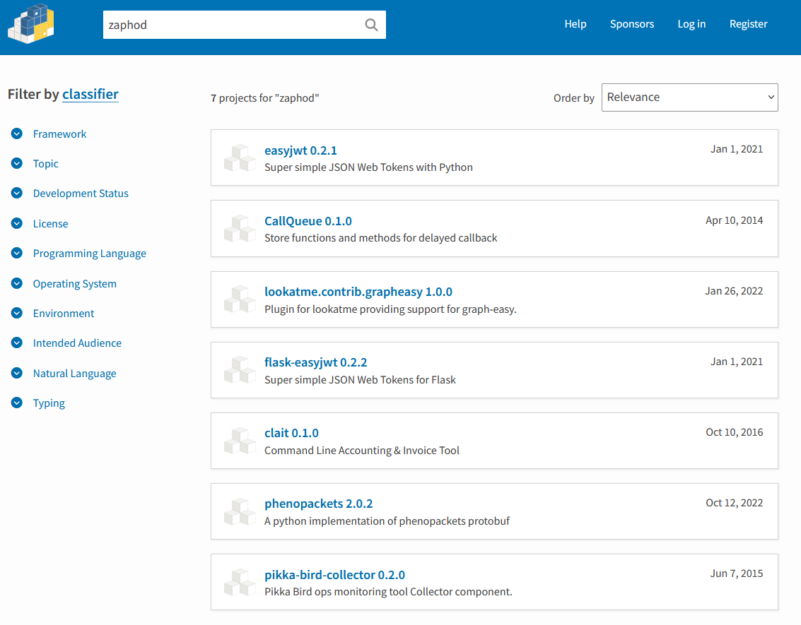
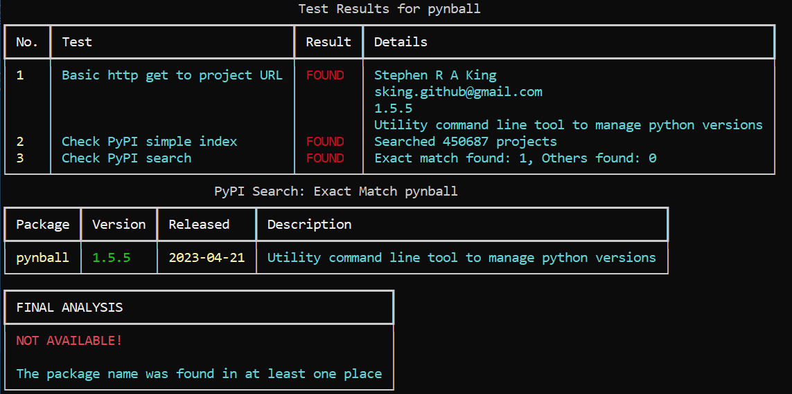
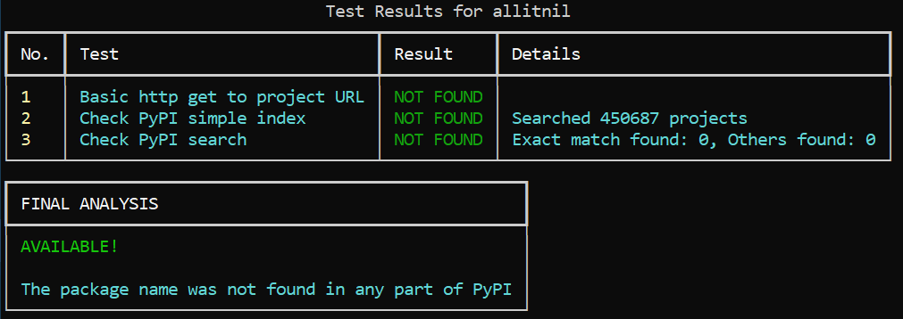
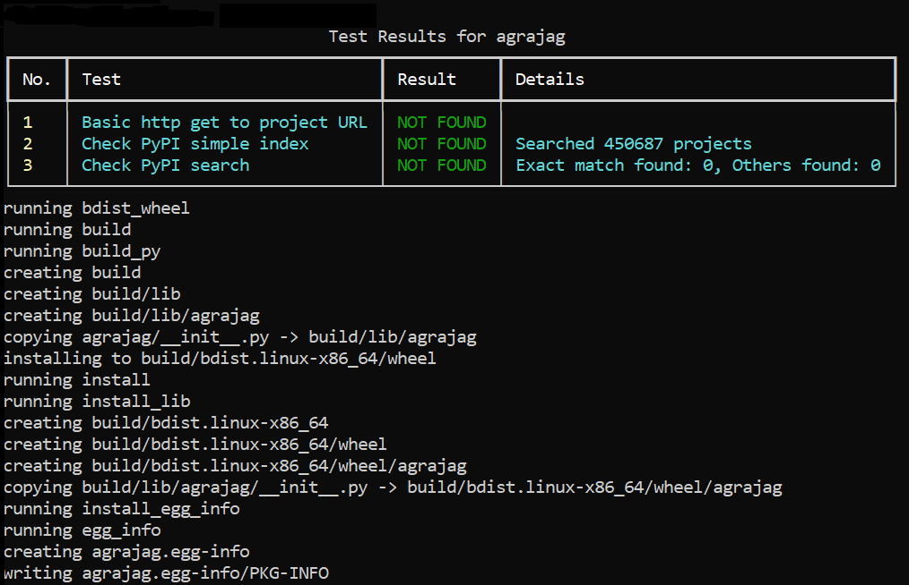
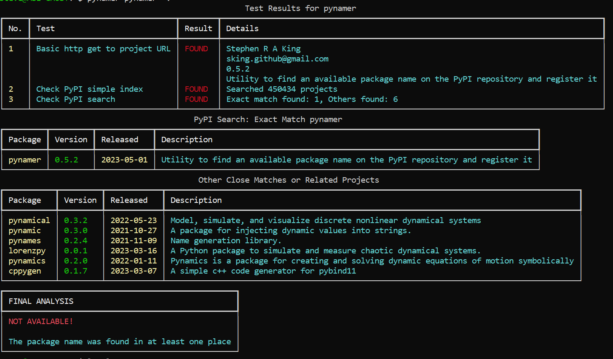
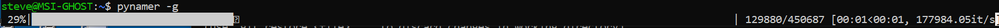
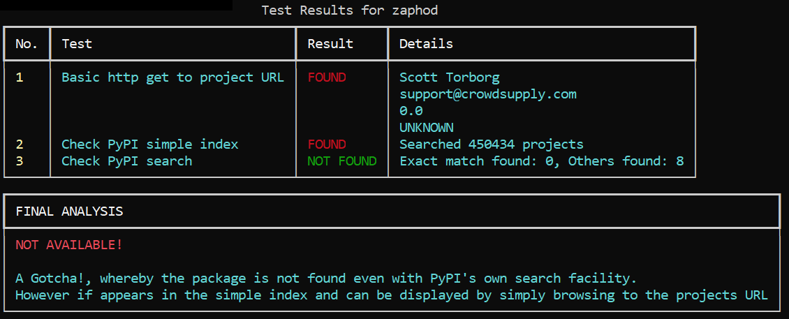
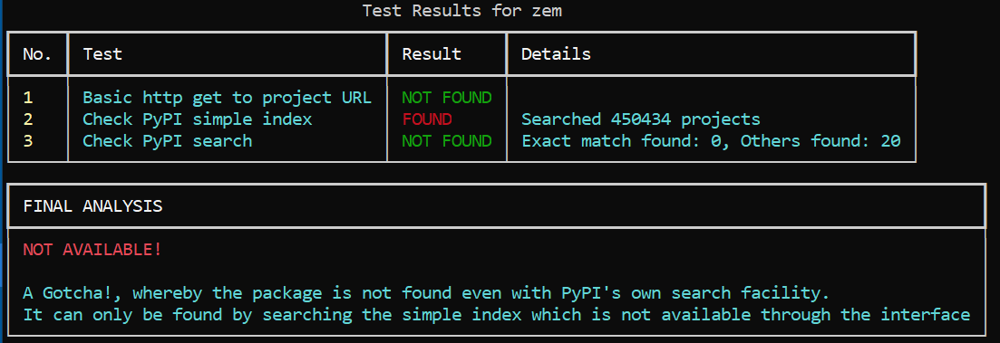

# pynamer

_**Utility to find an available package name on the PyPI repository and optionally 'register' it.**_

[![PyPI][pypi-image]][pypi-url]
[![Downloads][downloads-image]][downloads-url]
[![Status][status-image]][pypi-url]
[![Python Version][python-version-image]][pypi-url]
[![Format][format-image]][pypi-url]
[![tests][tests-image]][tests-url]
[![Codecov][codecov-image]][codecov-url]
[![pre-commit][pre-commit-image]][pre-commit-url]
[![pre-commit.ci status][pre-commit.ci-image]][pre-commit.ci-url]
[![CodeFactor][codefactor-image]][codefactor-url]
[![Codeclimate][codeclimate-image]][codeclimate-url]
[![CodeQl][codeql-image]][codeql-url]
[![readthedocs][readthedocs-image]][readthedocs-url]
[![Imports: isort][isort-image]][isort-url]
[![Code style: black][black-image]][black-url]
[![Checked with mypy][mypy-image]][mypy-url]
[![security: bandit][bandit-image]][bandit-url]
[![Commitizen friendly][commitizen-image]][commitizen-url]
[![Conventional Commits][conventional-commits-image]][conventional-commits-url]
[![DeepSource][deepsource-image]][deepsource-url]
[![license][license-image]][license-url]

As a pseudo replacement for pip search, pynamer will quickly ascertain if a project name is 'available' on PyPI.


# Contents

-   [tl;dr](#TLDR)
-   [Introduction](#Introduction)
-   [Quick Start](#Quick-Start)
    -   [Prerequisites](#Prerequisites)
    -   [Installation](#Installation)
    -   [Basic Usage](#Basic-Usage)
-   [Usage](#Usage)
    -   [Specifying multiple names](#Specifying-multiple-names)
    -   [Using an input file](#Using-an-input-file)
    -   [Saving the results to a file](#Saving-the-results-to-a-file)
    -   [Register the name with PyPI](#Register-the-name-with-PyPI)
    -   [Verbose output](#Verbose-output)
    -   [Regenerate the PyPI simple Repository Index](#Regenerate-the-PyPI-simple-Repository-Index)
-   [The oddities](#The-Oddities)
-   [Planned Future improvements](#Planned-Future-improvements)
-   [Documentation](#Documentation)
    -   [Read the Docs](https://pynamer.readthedocs.io/en/latest/)
    -   [Wiki](https://github.com/Stephen-RA-King/pynamer/wiki)

## Introduction

### Project Rationale

Some of you may have reached the point where you want to publish a package on the PyPI python repository.
The first step of which is to choose a unique name. Here lies the problem.

A recent look at the PyPI repository revealed there were over 449,007 projects, so many names have already been taken.

pip leaps to the rescue with its search utility... or does it?

```python
pip search zaphod
```

```commandline
ERROR: XMLRPC request failed [code: -32500]
RuntimeError: PyPI no longer supports 'pip search' (or XML-RPC search).
Please use https://pypi.org/search (via a browser) instead.
See https://warehouse.pypa.io/api-reference/xml-rpc.html#deprecated-methods for more information.
```

A quick search will show the internet replete with articles explaining the situation:

-   [The Register: Why Python's pip search isn't working](https://www.theregister.com/2021/05/25/pypi_search_error/)
-   [Python.org discussion: Pip search is still broken](https://discuss.python.org/t/pip-search-is-still-broken/18680)

OK so I go to the PyPI website and do a search for 'zaphod' as suggested by pip and 7 results are displayed none of which have the package name 'zaphod'



Fantastic! I now think unbelievably that I have a unique name for a project that I can use.
So, I go ahead and code my new project, along with all the test files, documentation and meta data.
I diligently debug and commit and push to git and github so I have a history.

Finally the project is good enough to release and publish as an installable package on PyPI.

Here goes....

```commandline
python -m twine upload --config-file .pypirc dist/*
Uploading distributions to https://upload.pypi.org/legacy/
Uploading zaphod-0.0.0-py3-none-any.whl
100% ---------------------------------------- 3.8/3.8 kB • 00:00 • ?
WARNING  Error during upload. Retry with the --verbose option for more details.
ERROR    HTTPError: 403 Forbidden from https://upload.pypi.org/legacy/
         The user 'stephenking' isn't allowed to upload to project 'zaphod'. See https://pypi.org/help/#project-name for more information.
```

AARGH!

What just happened?

Yes unbelievably the project already exists and yes unbelievably PyPI's own search
did not find the project.

Enter Pynamer that does not rely on a single method of finding a PyPI package:

#### TLDR

Pynamer uses the following methods to ascertain whether a package already exists on PyPI:

-   A simple request to the project url on PyPI.
-   Uses the PyPI "simple" repository - a text-based listing of all the packages available on PyPI.
-   Uses PyPI's own search engine and scrapes the results.

Pynamer provides a way to optionally 'register' a name on PyPI by building a minimalistic package and uploading

## Quick Start

---

### Prerequisites

---

-   [x] Python >= 3.9.
-   [x] [**pipx**](https://pypa.github.io/pipx/)

The following are optional but required for 'registering' a project name on PyPI

-   [x] An account on PyPI (generate an API token).
-   [x] A [**.pypirc**](https://packaging.python.org/en/latest/specifications/pypirc/) file containing your PyPI API key

    or

-   [x] [Twine environment variables](https://twine.readthedocs.io/en/latest/#environment-variables)

Your .pypirc file should contain the following and be on your PATH:

```file
[distutils]
index-servers =
    pypi

[pypi]
repository = https://upload.pypi.org/legacy/
username = __token__
password = your_API_token_here
```

### Installation

```sh
pipx install pynamer
```

### Basic Usage

#### A package name that is not available

```commandline
~ $ pynamer flake8
```



#### A package name that is available

Holy smoke batman! You've managed to identify a unique name.

Yes, even though the odds were against you (given there are over 450,000+ registered projects), you did it!
Even though the name has nothing in common with your project, or may not even be a real word... you did it!

```commandline
~ $ pynamer allitnil
```



# Usage

---

Display the help menu ...

```commandline
pynamer --help
usage: pynamer [-h] [-r] [-f FILE] [-o OUTPUT] [-v] [-g] [projects ...]

Determine if project name is available on pypi with the option to 'register' it for future use if available

positional arguments:
  projects              Optional - one or more project names

optional arguments:
  -h, --help            show this help message and exit
  -r, --register        Register the name on PyPi if the name is available
  -f FILE, --file FILE  File containing a list of projects to analyze
  -o OUTPUT, --output OUTPUT
                        File to output the results to
  -v, --verbose         output additional information
  -g, --generate        Generate a new PyPI simple index
```

## Specifying multiple names

You can specify as many names as you like from the command line e.g.

```commandline
~ $ pynamer ganymede europa callisto
```

## Using an input file

You can use the -f argument to specify a file containing the a names of projects to analyze.
You specify a space separated sequence of as many names as you like on as many lines as you like. e.g.

'projects' file

```file
ganymede europa
IO callisto
```

Then specify the -f argument

```commandline
~ $ pynamer -f projects
```

You can use the input file with names from the command line. The names will be aggregated. e.g.

```commandline
~ $ pynamer ersa pandia leda metis -f projects
```

## Saving the results to a file

You can specify a file to write the result to by using the -o argument. e.g.

```commandline
~ $ pynamer ersa pandia leda -o results
```

This will write a file e.g.

results

```file
Result from pynamer PyPI utility 2023-05-02
-------------------------------------------
test 1 - Basic url lookup on PyPI
test 2 - Search of PyPIs simple index
test 3 - Search using an request to PyPIs search 'API'.

Project name    Test1      Test2        Test 3          Conclusion
-------------------------------------------------------------------
ersa            Found       Found       Found           Not Available
pandia          Not Found   Not Found   Found           Not Available
leda            Not Found   Not Found   Not Found       Available
```

Again you can use a combination of names from the command line and input file.

## Register the name with PyPI

You can optionally 'register' the name on PyPI by using the -r argument.
If the project name is found to be available and you have a valid 'pypirc' file is found, a minimalistic project will be built and uploaded to
to PyPI.

```commandline
~ $ pynamer agrajag
```



## Verbose output

ith the -v argument you can display the first page of all other project matched by PyPIs search API - ordered by relevance.
The algorithm that PyPI uses to select these in unknown but seems to be a mixture of names and other
projects written by the same author.

```commandline
~ $ pynamer pynamer -v
```



## Regenerate the PyPI simple Repository Index

As one of its tests Pynamer makes use of a list of package names scraped from its simple index site.

The PyPI Simple Index is a plain text file that lists the names of all the packages available on PyPI.

It is a simplified version of the PyPI index that makes it easier for users to browse and download packages.

The PyPI Simple Index is used by a variety of tools and libraries to download and install packages from PyPI. For example, the pip package manager, which is used to install and manage Python packages, uses the PyPI Simple Index to find packages.

The PyPI Simple Index is updated every few hours

Using the -r argument can be used to regenerate the local file contents.

```commandline
~ $ pynamer -g
```



See planned future improvements

## The Oddities

The reason I wrote this application in the first place.

```commandline
~ $ pynamer zaphod
```



Even worse ...

```commandline
~ $ pynamer zem
```



## Planned Future improvements

-   Improve performance of the regeneration of the PyPI simple Repository Index, so this can be run in the background automatically.
-   Filter out invalid PyPI package names at the start

## Documentation

---

[**Read the Docs**](https://pynamer.readthedocs.io/en/latest/)

-   [**Example Usage**](https://pynamer.readthedocs.io/en/latest/example.html)
-   [**Credits**](https://pynamer.readthedocs.io/en/latest/example.html)
-   [**Changelog**](https://pynamer.readthedocs.io/en/latest/changelog.html)
-   [**API Reference**](https://pynamer.readthedocs.io/en/latest/autoapi/index.html)

[**Wiki**](https://github.com/Stephen-RA-King/pynamer/wiki)

## Meta

---

[](https://www.linkedin.com/in/sr-king)
[](https://github.com/Stephen-RA-King)
[](https://pypi.org/project/pynamer)
[](https://www.justpython.tech)
[](mailto:sking.github@gmail.com)

Stephen R A King : [sking.github@gmail.com](sking.github@gmail.com)

Distributed under the MIT license. See [![][license-image]][license-url] for more information.

Created with Cookiecutter template: [**pydough**][pydough-url] version 1.2.2

<!-- Markdown link & img dfn's -->

[bandit-image]: https://img.shields.io/badge/security-bandit-yellow.svg
[bandit-url]: https://github.com/PyCQA/bandit
[black-image]: https://img.shields.io/badge/code%20style-black-000000.svg
[black-url]: https://github.com/psf/black
[pydough-url]: https://github.com/Stephen-RA-King/pydough
[codeclimate-image]: https://api.codeclimate.com/v1/badges/7fc352185512a1dab75d/maintainability
[codeclimate-url]: https://codeclimate.com/github/Stephen-RA-King/pynamer/maintainability
[codecov-image]: https://codecov.io/gh/Stephen-RA-King/pynamer/branch/main/graph/badge.svg
[codecov-url]: https://app.codecov.io/gh/Stephen-RA-King/pynamer
[codefactor-image]: https://www.codefactor.io/repository/github/Stephen-RA-King/pynamer/badge
[codefactor-url]: https://www.codefactor.io/repository/github/Stephen-RA-King/pynamer
[codeql-image]: https://github.com/Stephen-RA-King/pynamer/actions/workflows/github-code-scanning/codeql/badge.svg
[codeql-url]: https://github.com/Stephen-RA-King/pynamer/actions/workflows/github-code-scanning/codeql
[commitizen-image]: https://img.shields.io/badge/commitizen-friendly-brightgreen.svg
[commitizen-url]: http://commitizen.github.io/cz-cli/
[conventional-commits-image]: https://img.shields.io/badge/Conventional%20Commits-1.0.0-yellow.svg?style=flat-square
[conventional-commits-url]: https://conventionalcommits.org
[deepsource-image]: https://static.deepsource.io/deepsource-badge-light-mini.svg
[deepsource-url]: https://deepsource.io/gh/Stephen-RA-King/pynamer/?ref=repository-badge
[downloads-image]: https://static.pepy.tech/personalized-badge/pynamer?period=total&units=international_system&left_color=black&right_color=orange&left_text=Downloads
[downloads-url]: https://pepy.tech/project/pynamer
[format-image]: https://img.shields.io/pypi/format/pynamer
[isort-image]: https://img.shields.io/badge/%20imports-isort-%231674b1?style=flat&labelColor=ef8336
[isort-url]: https://github.com/pycqa/isort/
[lgtm-alerts-image]: https://img.shields.io/lgtm/alerts/g/Stephen-RA-King/pynamer.svg?logo=lgtm&logoWidth=18
[lgtm-alerts-url]: https://lgtm.com/projects/g/Stephen-RA-King/pynamer/alerts/
[lgtm-quality-image]: https://img.shields.io/lgtm/grade/python/g/Stephen-RA-King/pynamer.svg?logo=lgtm&logoWidth=18
[lgtm-quality-url]: https://lgtm.com/projects/g/Stephen-RA-King/pynamer/context:python
[license-image]: https://img.shields.io/pypi/l/pynamer
[license-url]: https://github.com/Stephen-RA-King/pynamer/blob/main/license
[mypy-image]: http://www.mypy-lang.org/static/mypy_badge.svg
[mypy-url]: http://mypy-lang.org/
[pre-commit-image]: https://img.shields.io/badge/pre--commit-enabled-brightgreen?logo=pre-commit&logoColor=white
[pre-commit-url]: https://github.com/pre-commit/pre-commit
[pre-commit.ci-image]: https://results.pre-commit.ci/badge/github/Stephen-RA-King/pynamer/main.svg
[pre-commit.ci-url]: https://results.pre-commit.ci/latest/github/Stephen-RA-King/pynamer/main
[pypi-url]: https://pypi.org/project/pynamer/
[pypi-image]: https://img.shields.io/pypi/v/pynamer.svg
[python-version-image]: https://img.shields.io/pypi/pyversions/pynamer
[readthedocs-image]: https://readthedocs.org/projects/pynamer/badge/?version=latest
[readthedocs-url]: https://pynamer.readthedocs.io/en/latest/?badge=latest
[status-image]: https://img.shields.io/pypi/status/pynamer.svg
[tests-image]: https://github.com/Stephen-RA-King/pynamer/actions/workflows/tests.yml/badge.svg
[tests-url]: https://github.com/Stephen-RA-King/pynamer/actions/workflows/tests.yml
[wiki]: https://github.com/Stephen-RA-King/pynamer/wiki
